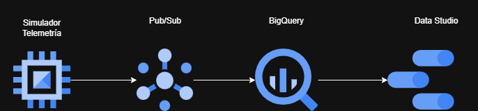

# 🏎️ Canalización de datos para telemetría F1

¡Bienvenido al desafío práctico de Ingeniería de Datos! En este repositorio construirás un pipeline de datos sobre **Google Cloud Platform (GCP)**, procesando telemetría de Fórmula 1 de la temporada 2023 con la librería `fastf1`.

---

## 📈 Valor Profesional de este Proyecto

El mercado de Big Data se está moviendo hacia el procesamiento en tiempo real (Streaming). Al completar este proyecto, dominarás competencias clave altamente demandadas por empresas tecnológicas globales:

* **Arquitectura Kappa:** Aprenderás a tratar todo como un flujo continuo de datos, eliminando la complejidad de mantener capas de lote (Batch) y streaming por separado.
* **Paradigma Serverless:** Configurarás herramientas como **Pub/Sub** y **BigQuery** que escalan automáticamente, una habilidad crucial para optimizar costos de infraestructura en la nube.

---

## 🏗️ Arquitectura del Sistema

El flujo de datos se ejecuta de manera 100% continua y eficiente:



## Creación de tópico para intercambio de telemetría
```
gcloud pubsub topics create telemetria-f1
```

## Creación de subscripción para prueba del simulador
```
gcloud pubsub subscriptions create sub-prueba-f1 --topic=telemetria-f1
```

## Consumo de mensajes generados por el simulador desde la CLI
```
gcloud pubsub subscriptions pull sub-prueba-f1 --auto-ack --limit=5
```

## Creación de dataset destino en BigQuery
```
bq mk dataset_f1
```

## Pasos para habilitar cuenta de servicio de Pub/Sub para interactuar con BigQuery

### Paso 1: creación de variable con el número de proyecto
```
PROJECT_NUMBER=$(gcloud projects describe TU_ID_PROYECTO --format="value(projectNumber)")
```

### Paso 2: Otorgar el rol de Editor de Datos de BigQuery
```
gcloud projects add-iam-policy-binding TU_ID_PROYECTO \
  --member="serviceAccount:service-${PROJECT_NUMBER}@gcp-sa-pubsub.iam.gserviceaccount.com" \
  --role="roles/bigquery.dataEditor"
```

### Paso 3: Crear subscripción de tabla en BigQuery hacia tópico en Pub/sub
```
gcloud pubsub subscriptions create f1-telemetry-bq-sub \
  --topic=telemetria-f1 \
  --bigquery-table=PROJECT.DATASET.TABLE \
  --use-table-schema \
  --drop-unknown-fields
```
